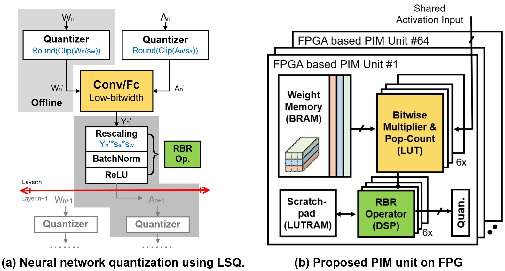
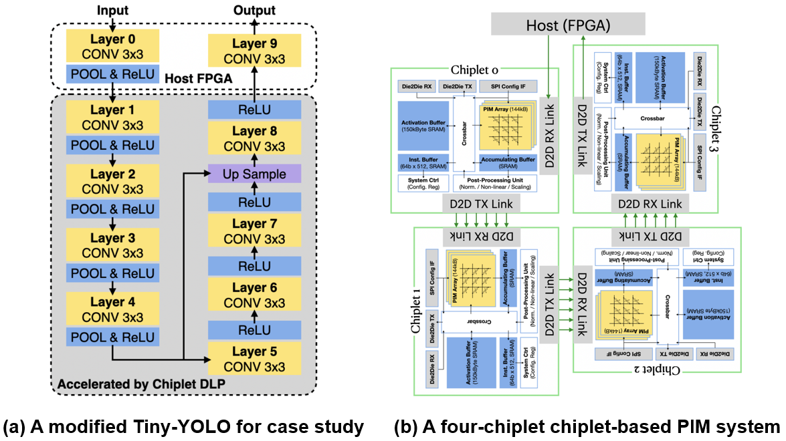
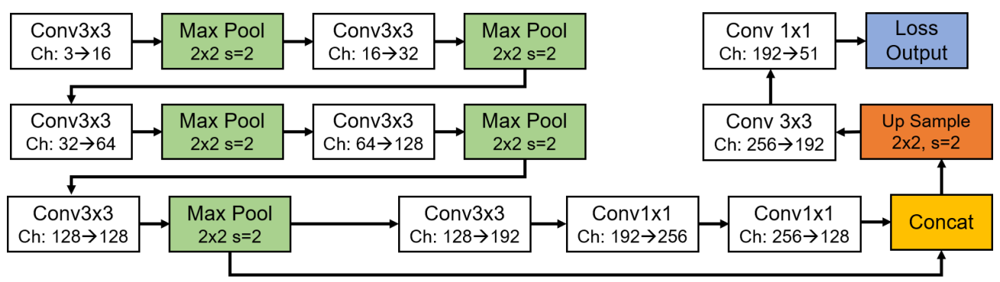

# Tiny-YOLO with 3-bit quantization

This repository only contains the network quantization part of the following two papers. 
This repository is also a solution for the DAC Lower Power Object Detection Challenge (DAC-LPODC). 
All models are trained on the DAC-2020 LPODC dataset and the PyTorch is adopted.  
Firstly, we simplify the original [Tiny-YOLOv3](https://github.com/eriklindernoren/PyTorch-YOLOv3) model by deleting unnecessary convolutional layers and cutting down the number of channels.
Secondly, [LSQ-Net](https://github.com/zhutmost/lsq-net) is adopted to quantize the reduced Tiny-YOLOv3 into low-bit-width.

**ASP-DAC '21: A 0.57-GOPS/DSP Object Detection PIM Accelerator on FPGA**  
\[[PDF](https://shunli-wang.github.io/publications/pdf/slwang_PIM_Accelerator_on_FPGA.pdf)\]
\[[BibTex](https://shunli-wang.github.io/publications/bibtex/slwang_PIM_Accelerator.bib)\]
<!--    -->

**GLSVLSI '21: Computing Utilization Enhancement for Chiplet-Based Homogeneous Processing-in-Memory Deep Learning Processors**  
\[[PDF](https://shunli-wang.github.io/publications/pdf/slwang_chiplet.pdf)\]
\[[Video](https://dlnext.acm.org/action/downloadSupplement?doi=10.1145%2F3453688.3461499&file=GLSVLSI2021-glsv073.mp4)\]
\[[BibTex](https://shunli-wang.github.io/publications/bibtex/slwang_Chiplet.bib)\]
<!--   -->

## Architecture of the Reduced Tiny-YOLOv3 
The specific network structure is as follows. 
To improve the efficiency, we modified the original [Tiny-YOLOv3](https://github.com/eriklindernoren/PyTorch-YOLOv3) to make it more suitable for quantification and deployment in dardware. 
All convolutional layers are quantized to 3-bit excepts the first layer and the last layer.
In the first layer, only the convolutional kernels are quantized to 3-bit while the input image is not.
In the last layer, the convolutional kernels are quantized to 3-bit while the activations are quantized to 9-bit.

 

## User Guide

**1\. Clone this repository.**
```bash
git clone https://github.com/Shunli-Wang/Tiny-YOLO-LSQ
cd Tiny-YOLO-LSQ
```

**2\. Download dataset & Create links.**  
You can download the whole dataset from DAC, [BaiduYun](https://pan.baidu.com/s/1VTfyDn4sDDLI6IqRsF7Ygg) [whk6], or [TeraBox](https://terabox.com/s/1Htju6241YK3JEVhBHnez3g) [ai1u]. Then unzip the dataset and creat a soft link.
```bash
tar zxvf DAC-LPODC-Dataset.tar.gz && rm DAC-LPODC-Dataset.tar.gz
mv DAC-LPODC-Dataset /PATH/TO/
cd Tiny-YOLO-LSQ
ln -s /PATH/TO/DAC-LPODC-Dataset/ ./data
```

**3\. Create conda env.**  
```bash
conda create -n Tiny-yolov3-lsq python
conda install pytorch torchvision cudatoolkit=10.2 -c pytorch
pip install -r requirements.txt
```

**4\. Training.**  
The training of the quantized network contains two phases. 
A full-precision model (fp-model) is trained frist, and then is the quantized model (q-model). The fp-model is loaded as the pre-trained model during the training of the q-model.  
We provide the pre-trained fp-model in `./exps/fp_ckpt`, so you can directly run the quantization training by:
```bash
python train.py  --exp_path 'exps/lsq_ckpt/' \
        --quan_yaml 'config/yolov3-tiny_lsq.yaml' \
        --fp_pretrained 'exps/fp_ckpt/fp_ckpt_94.pth'
# The fp_ckpt_94.pth achieves the best acc on the val set, so we adopt it as the pre-trained model to initialize the quantized model.
```

You can reproduce the training process of the fp-model by:
You can train the fp-model by:
```bash
python train.py --exp_path 'exps/fp_ckpt/'
```

**5\. Testing.**  
You can use the `test.py` to evaluate fp-model and q-model by the following comands:  
For the q-model:
```bash
python test.py --weights_path 'exps/lsq_ckpt/lsq_ckpt_92.pth' --quan_yaml 'config/yolov3-tiny_lsq.yaml'
```
For the fp-model:
```bash
python test.py --weights_path 'exps/fp_ckpt/fp_ckpt_94.pth'
```

## Citation
If this repository is helpful to you, please star it. If you find our work useful in your research, please consider citing:
```
@inproceedings{PIM_Accelerator,
        title = {A 0.57-GOPS/DSP Object Detection PIM Accelerator on FPGA},
        author = {Jiao, Bo and Zhang, Jinshan and Xie, Yuanyuan and Wang, Shunli and Zhu, Haozhe and Kang, Xiaoyang and Dong, Zhiyan and Zhang, Lihua and Chen, Chixiao},
        year = {2021},
        booktitle = {Proceedings of the 26th Asia and South Pacific Design Automation Conference (ASP-DAC '21)},
        pages = {13–14},
        numpages = {2},
}
@inproceedings{Chiplet_PIM,
        author = {Jiao, Bo and Zhu, Haozhe and Zhang, Jinshan and Wang, Shunli and Kang, Xiaoyang and Zhang, Lihua and Wang, Mingyu and Chen, Chixiao},
        title = {Computing Utilization Enhancement for Chiplet-Based Homogeneous Processing-in-Memory Deep Learning Processors},
        year = {2021},
        booktitle = {Proceedings of the 2021 on Great Lakes Symposium on VLSI},
        pages = {241–246},
        numpages = {6}
        }
```
